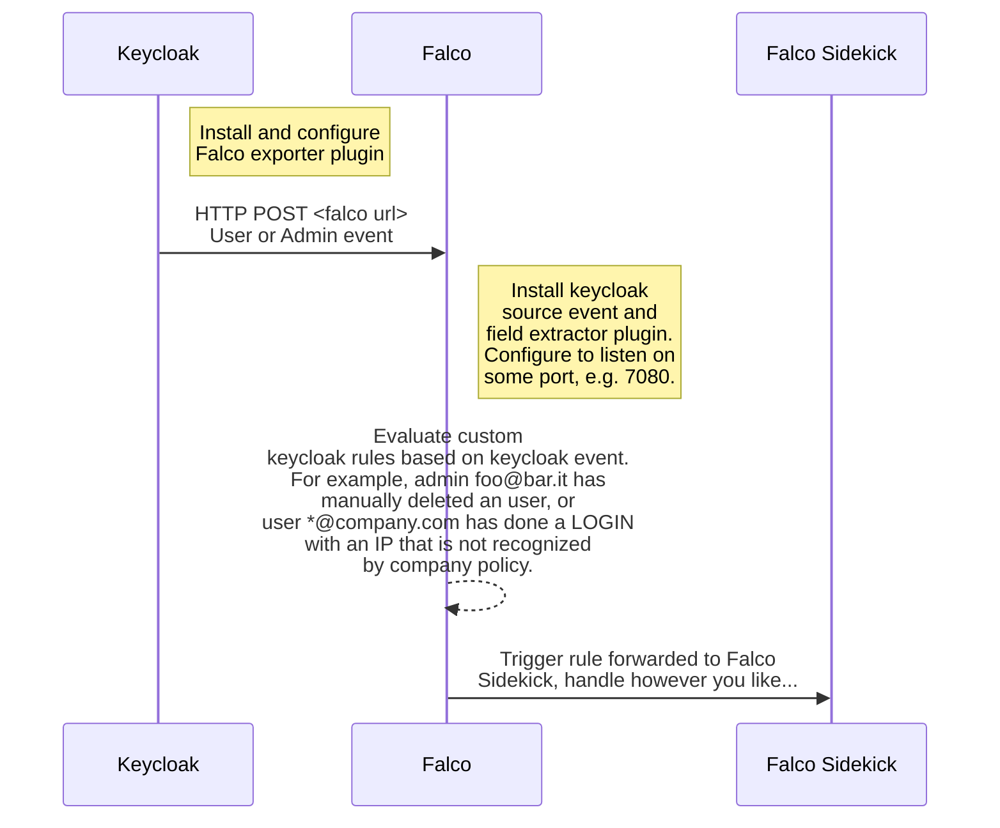

# Falco Keycloak plugin

This repository contains a Falco plugin for sourcing and extracting Keycloak events. If you want to use this plugin you also have to configure keycloak to export events by installing the [keycloak falco exporter plugin](https://github.com/mattiaforc/keycloak-events-falco-exporter).

## Architecture

The integration with Keycloak requires:

- Keycloak with the [falco exporter](https://github.com/mattiaforc/keycloak-events-falco-exporter) configured and installed.
- This Falco plugin installed and configured. The configuration needs at least to expose an HTTP endpoint in order to let Keycloak forward its user/admin events. What type of events are forwarded are configured on Keycloak side.
- *Optional*: Falco JSON plugin for accessing arbitrary JSON fields in user/admin events.



## Configuration

The plugin embeds a webserver that listens on a configurable port and accepts POST requests. The webserver of the plugin can be configuted as part of the plugin's init configuration and open parameters.

An example of a simple Falco configuration for using this plugin and the JSON plugin as well (as you can also see inside the [`docker-compose.yml`](https://github.com/mattiaforc/keycloak-events-falco-exporter/blob/main/docker-compose.yaml) example in the Keycloak exporter repository, mounting this [`falco.yaml`](https://github.com/mattiaforc/keycloak-events-falco-exporter/blob/main/hack/falco.yaml) configuration file):

```yaml
plugins:
  - name: keycloak
    library_path: /usr/share/falco/plugins/libkeycloak.so
    init_config: ''
    open_params: 'http://0.0.0.0:7080/keycloak'
  - name: json
    library_path: libjson.so
    init_config: ""

load_plugins:
  - keycloak
  - json # This is not stricty required for the keycloak plugin to work
```

Possible configurations that can be passed inside the `init_config` stanza are:

- `sslCertificate`: If you plan to expose the listener using HTTPS, this is the certificate (defaults to `/etc/falco/falco.pem`).
- `sslKey`: If you plan to expose the listener using HTTPS, this is the key (defaults to `/etc/falco/key.pem`).

The init config simply takes the URL that the listener will listen on: you can choose an arbitrary port and path, simply remember to [configure the Keycloak exporter](https://github.com/mattiaforc/keycloak-events-falco-exporter?tab=readme-ov-file#configuration) accordingly.

## Event source and supported fields

The `keycloak` plugin implements event sourcing and field extraction for Keycloak user events and admin events. The event source is `keycloak`.

### Supported fields

NAME | TYPE | ARG | DESCRIPTION
-|-|-|-
`keycloak.eventID` | `string` | None | The ID of the keycloak event.
`keycloak.error` | `string` | None | The event error, if any.
`keycloak.realmID` | `string` | None | The ID of the realm.
`keycloak.user.eventType` | `string` | None | The event type.
`keycloak.user.clientID` | `string` | None | The ID of the client.
`keycloak.user.userID` | `string` | None | The ID of the user.
`keycloak.user.sessionID` | `string` | None | The user session ID.
`keycloak.user.ipAddress` | `string` | None | The user IP address.
`keycloak.admin.authDetails.realmID` | `string` | None | The authentication realmID for this AdminEvent.
`keycloak.admin.authDetails.clientID` | `string` | None | The authentication clientID for this AdminEvent.
`keycloak.admin.authDetails.userID` | `string` | None | The authenticated userID that triggered this AdminEvent.
`keycloak.admin.authDetails.ipAddress` | `string` | None | The IP address of the user that triggered this AdminEvent.
`keycloak.admin.resourceType` | `string` | None | The resource the AdminEvent was triggered for.
`keycloak.admin.operationType` | `string` | None | The type of the AdminEvent operation.
`keycloak.admin.resourcePath` | `string` | None | The resource path for the AdminEvent.

Other than these fields, you can access the arbitrary JSON metadata that keycloak sends in the event, the `Details` for user events and `Representation` for admin events - by using Falco JSON plugin. This is because the fields are defined as an arbitrary `Map<String, String>` in Keycloak, so this plugin just allows you to access its raw values.

For example, if you want to create a rule every time an admin action is made on a user, you can access the subject user's email for example in the `Representation` field:

```yaml
rule: Keycloak admin event
desc: Received keycloak admin event
condition: kc_adm_evt
output: Action made on user=%json.value[/Representation/username] by user %keycloak.admin.authDetails.userID with IP=%keycloak.admin.authDetails.ipAddress
priority: DEBUG
source: keycloak
tags: [keycloak, keycloak_admin]
```

The same thing goes for user event `Details`, accessing it with `%json.value[/Details/<field>]`.

Another example of a rule that is triggered for every user event (useful for debugging):

```yaml
rule: Keycloak user event
desc: Received keycloak user event
condition: kc_usr_evt
output: event type=%keycloak.user.eventType for user=%keycloak.user.userID on realm=%keycloak.realmID and client=%keycloak.user.clientID with IP=%keycloak.user.ipAddress
priority: DEBUG
source: keycloak
tags: [keycloak, keycloak_user]
```

## Development

The best way to develop this plugin is to clone the [Keycloak plugin as well](https://github.com/mattiaforc/keycloak-events-falco-exporter) and to use the `docker-compose.yml` and the keycloak sample configuration provided there. Otherwise the plugin development is pretty standard - once you have Go installed you can simply start to alter the plugin.

Requirement:

- Go >= 1.22

For building the plugin:

```bash
make
```

## Contributing

PRs and issues are very welcome, feel free to open them or reach out to me directly.
